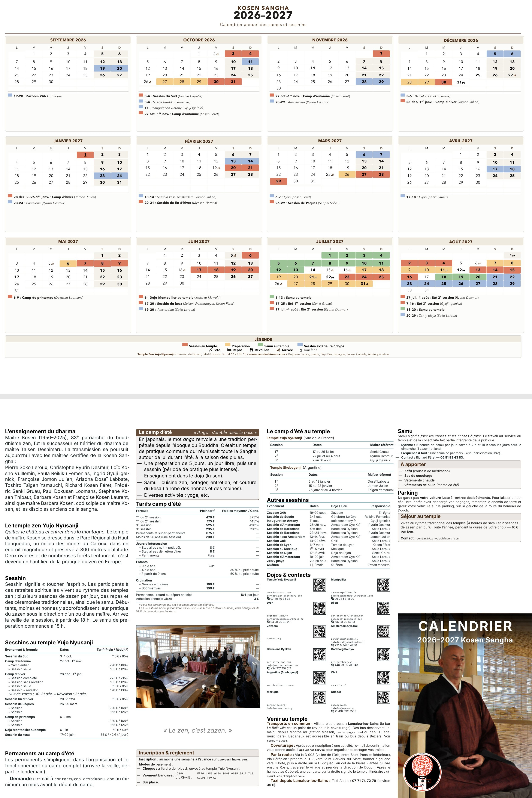
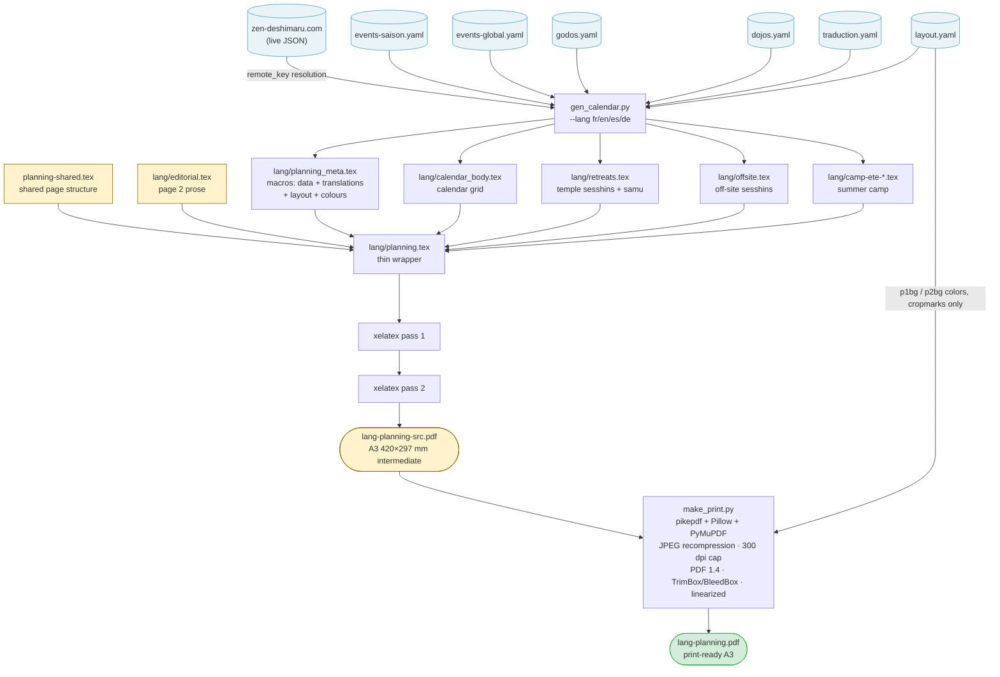

# Kosen Sangha — Publications & Plannings

This repository contains the LaTeX sources and automated publishing toolchain for the publications of Master Kosen and the Kosen Sangha (Association Bouddhiste Zen Deshimaru). It provides everything needed to build press-ready print PDFs, digital distribution formats, and accessible EPUB editions for both books and annual retreat calendars.

> **Target audiences & workflows:**
> - 👤 **Contributor**: *I need to change a date, price, translation, image, or layout.* → See [What should I edit?](#what-should-i-edit) and [Edit content](#edit-content).
> - 🔧 **Maintainer**: *I need to release the next season or modify the generator.* → See [Update a season](#update-a-season) and [Architecture](#architecture).
> - 🚀 **Build/Deployment Engineer**: *I need to reproduce GitHub Actions and understand PDF generation.* → See [CI/CD](#cicd) and [Reproducing CI locally](#reproducing-ci-locally).

### What this repository builds

- **Sesshin planning posters**: Annual sesshin calendar posters in A3 print-ready (with bleed and crop marks) and A4 digital formats across multiple languages (FR, EN, ES, DE).
- **Shinjinmei Commentaries** (*Commentaires du Shinjinmei — « Recueil de poèmes sur la foi en l'esprit »*): 3-volume commentary series and complete single-volume edition (PDF/X-4 press-ready, book covers, contact sheets, Markdown, EPUB 3).
- **The Inner Revolution** (*La révolution intérieure*): Standalone book (~375 pages, illustrated glossary, numbered proofreading edition, press-ready covers, EPUB 3).
- **Chronicles of Great Wisdom** (*Chroniques de la grande sagesse / Prajñā Pāramitā*): Commentary book (~355 pages, calligraphies, 5 glossary streams, subject index, EPUB 3).

Final PDFs and release artifacts are built automatically by GitHub Actions on every push and pull request.

---

## Quick start

| Command | Description |
|---|---|
| `make help` | List all available Makefile targets with descriptions |
| `make planning` | Build all sesshin planning posters (FR · EN · ES) in print-ready A3 format |
| `make tomes` | Build all three *Commentaires du Shinjinmei* tomes in PDF/X-4 format |
| `make revolution` | Build *The Inner Revolution* (*La révolution intérieure*) interior (~375 p.) |
| `make prajna` | Build *Chronicles of Great Wisdom* (*Chroniques de la grande sagesse*) interior (~355 p.) |
| `make clean` | Remove generated root PDFs and auxiliary LaTeX build files |

*For detailed target options and parameters, see [Sesshin planning](#sesshin-planning), [Publications](#publications), and [Development](#development).*

---

## Repository structure

```
.
├── planning/              # Sesshin planning sources, YAML data, and calendar engine
│   ├── events-<season>.yaml  # Seasonal events, dates, and tariffs (e.g. events-26-27.yaml)
│   ├── events-global.yaml    # Shared metadata across seasons (IBAN, taxi, samu)
│   ├── godos.yaml            # Teachers and retreat directors roster
│   ├── dojos.yaml            # Venues, addresses, and contact directories
│   ├── traduction.yaml       # Multilingual UI strings and vocabulary (FR / EN / ES)
│   ├── layout.yaml           # Typographic parameters, dimensions, and color palette
│   ├── gen_calendar.py       # Python calendar generator and LaTeX emitter
│   ├── planning-shared.tex   # Shared structural template for Page 1 and Page 2
│   ├── SAISON-CHECKLIST.md   # Step-by-step procedure for annual season updates
│   └── <lang>/               # Language subdirectories (fr/, en/, es/, de/, kl/)
│       ├── planning.tex      # Thin wrapper setting language and loading shared template
│       └── editorial.tex     # Page 2 narrative prose (directions, access, samu)
├── sections/              # Shinjinmei source chapters, poems, and commentary texts
├── revolution/            # "The Inner Revolution" LaTeX interior sources
├── prajna/                # "Chronicles of Great Wisdom" (Prajñā) LaTeX interior sources
├── images/                # Shared photographic assets, cover artwork, and venue QR codes
├── fonts/                 # Bundled typography (EB Garamond, Cormorant, Jura, Montserrat, Bebas)
├── assets/                # Iconography and vector assets
├── .github/workflows/     # GitHub Actions automated CI/CD workflows
└── Makefile               # Central build entry point for all publications
```

- **`planning/`** contains all planning-specific data, translation dictionaries, calendar generator logic, and LaTeX templates.
- **Book directories** (`sections/`, `revolution/`, `prajna/`) contain the respective source chapters, preambles, and glossaries for Master Kosen's books.
- **Shared resources** (`images/`, `fonts/`, `assets/`) provide common visual assets, fonts, and icons consumed across publications.
- **`Makefile`** provides the central local build interface for all books, plannings, covers, and EPUBs.
- **`.github/workflows/`** contains the GitHub Actions workflows for continuous integration and automated reference PDF generation.

---

## What should I edit?

Use this table to find the authoritative source to edit for a particular change:

| I want to... | Edit |
|---|---|
| Change an event, date, price, or seasonal fact | `planning/events-<saison>.yaml` (e.g. `events-26-27.yaml`) |
| Change shared organizational data (IBAN, taxi, samu fees) | `planning/events-global.yaml` |
| Add or change a teacher/director | `planning/godos.yaml` |
| Add or change a practice dojo / venue | `planning/dojos.yaml` |
| Change multilingual translations (labels, month names, UI) | `planning/traduction.yaml` |
| Change typography, dimensions, or color palette | `planning/layout.yaml` |
| Change Page 2 narrative prose or directions | `planning/<lang>/editorial.tex` (e.g. `fr/editorial.tex`) |
| Change the shared page skeleton / structural grid | `planning/planning-shared.tex` |
| Change calendar computation or LaTeX emission logic | `planning/gen_calendar.py` |
| Change photographic images or venue QR codes | `images/` (and reference in `editorial.tex`) |
| Update the planning for a new academic year / season | [`planning/SAISON-CHECKLIST.md`](file:///Users/olivier/livres-latex/planning/SAISON-CHECKLIST.md) |

> [!WARNING]
> **Do not edit generated files manually.** Files such as `planning/<lang>/calendar_body.tex`, `planning/<lang>/planning_meta.tex`, `planning/<lang>/retreats.tex`, `planning/<lang>/offsite.tex`, and `planning/<lang>/camp-ete-*.tex` are overwritten automatically by `gen_calendar.py` on every build. See [Architecture](#architecture) below for the complete layer breakdown.

---

## Contents

- [Quick start](#quick-start)
- [Repository structure](#repository-structure)
- [What should I edit?](#what-should-i-edit)
- [Sesshin planning](#sesshin-planning)
  - [Build](#build)
  - [Edit content](#edit-content)
  - [Update a season](#update-a-season)
  - [Architecture](#architecture)
- [Publications](#publications)
  - [Shinjinmei](#shinjinmei)
  - [The Inner Revolution](#the-inner-revolution)
  - [Chronicles of Great Wisdom](#chronicles-of-great-wisdom)
- [CI/CD](#cicd)
  - [GitHub Actions](#github-actions)
  - [Reproducing CI locally](#reproducing-ci-locally)
- [Development](#development)
  - [Dependencies and prerequisites](#dependencies-and-prerequisites)
  - [Utility targets](#utility-targets)
  - [Troubleshooting](#troubleshooting)

---

<a id="sesshin-planning-poster"></a>

# Sesshin planning

The planning is a two-page A3 landscape document compiled directly with **xelatex** (custom fonts via `fontspec`, no A4→A3 scaling needed), then post-processed by `make_print.py` (`pikepdf` + `Pillow` + `PyMuPDF`, no Ghostscript) into a print-ready PDF: images recompressed to JPEG and downsampled to 300 dpi where their effective resolution exceeds it (never upsampled), PDF 1.4, embedded fonts, TrimBox/BleedBox, optional crop marks, linearized via `qpdf`. Page 1 is the colour-coded sesshin calendar for the current academic year (September–August); page 2 is a four-column text booklet with practical information.

### Planning branches

- **`main`**: Primary branch hosting the modern **Planning 2.0** engine (multi-month dynamic calendar grid on Page 1, structured 4-column informational booklet on Page 2).
- **`planning-1.0`**: Preserves the classic **Planning 1.0** layout and earlier release pipeline.
- **`fake-planning`**: Test sandbox featuring fictional, historical, and experimental test seasons (e.g. season `1000-1001` medieval fantasy edition with Fraktur fonts and medieval seals, season `5678-5679` Klingon test edition with pIqaD script and space photography, season `2735-2736`). It serves to stress-test calendar generation, layout boundaries, long strings, extreme date spans, and non-standard typography without modifying production data.
- **`draft`**: Working branch used for previewing drafts and staging upcoming changes before merging to `main`.

### Planning editions by branch

| `main` branch (Planning 2.0) | `planning-1.0` branch (Planning 1.0.1) |
|:---:|:---:|
|  |  |
| *`main` branch: Planning 2.0 (Recto above Verso)* | *`planning-1.0` branch: Planning 1.0.1 (Recto above Verso)* |

## Build

### Common build commands

| Command | Output / Description |
|---|---|
| `make planning` | All 3 standard languages (FR · EN · ES) — print-ready A3+bleed (424×301 mm) |
| `make planning-a4` (or `make a4`) | All 3 standard languages (FR · EN · ES) — A4 format without crop marks |
| `make planning-fr` / `planning-en` / `planning-es` | Single language — print-ready A3+bleed (424×301 mm) |
| `make planning-a4-fr` / `planning-a4-en` / `planning-a4-es` | Single language — A4 format without crop marks |
| `make planning-de` / `make planning-a4-de` | German edition (Fraktur typography) — A3 print-ready / A4 |
| `make planning-kl` / `make planning-a4-kl` | Klingon fan-conlang test edition (season `5678-5679`) — A3 / A4 |
| `make planning current` | Build planning for the current season (computed from current date) |
| `make planning next` | Build planning for the next upcoming season |
| `make planning fr` | Shortcut: build French planning for season `26-27` |
| `make diff-saison SAISON=26-27` | Human-readable diff of dates, prices, and events vs. previous season (`PREV=` to override) |
| `make planning-ci` | Build FR + EN + ES in the exact CI environment (TeX Live 2023, Linux AMD64 via Docker) |
| `make impr IMAGES=<dir> [BASE=name]` | PDF/X-4 A3 press-ready without Ghostscript from 2 source images |

### Season parameter

Add `SAISON=26-27` (or `SAISON=25-26`) to any planning target to force a specific season (default: current season):

```bash
make planning SAISON=26-27
make planning-en SAISON=26-27
```

### Crop marks

Planning A3 targets include 3 mm bleed and crop marks by default (`CROPMARKS=--cropmarks`). For digital distribution without crop marks, pass an empty `CROPMARKS=` parameter:

```bash
make planning-fr CROPMARKS=
```

---

## Edit content

All user-editable content is separated cleanly from LaTeX templates.

### Changing dates, events, and prices

Factual, relational, and numerical event data live in pure YAML files under `planning/`:

- **`planning/events-<saison>.yaml`** (e.g. `events-26-27.yaml`):
  - **Sesshins and retreats**: Event type (`type: sesshin|camp|samu`), venue (`dojo:` key), teacher (`godo:` key), and tariffs (`prix:`).
  - **Standing/recurring activity descriptions**: Multilingual `text:` dictionaries (e.g. for Québec: `text: { fr: "Une journée de zazen par mois.", en: "Monthly full-day zazen session", es: "Un día de zazen al mes." }`).
  - **Summer camps**: `camp_ete` and `camp_ete_argentina` sessions, preparation periods, ordinations, youth discounts.
- **`planning/events-global.yaml`**: Shared organizational metadata across seasons (`inscriptions.iban`, `inscriptions.bic`, `transport.taxi_prix`, `samu.sejour.price`, `protocole.arrivee_heure`).
- **`planning/godos.yaml`**: Roster of teachers/directors (`nom` (name), `statut: maitre|moine|nonne` (master/monk/nun), `genre` (gender)).
- **`planning/dojos.yaml`**: Practice venues, websites, contact emails, and phone numbers.

### Changing translations

- **`planning/traduction.yaml`**: All UI strings, section headings, table headers, labels, legend text, month names, day abbreviations, and Zen vocabulary terms in FR / EN / ES.

### Changing layout and typography

- **`planning/layout.yaml`**: Typographic scales, font sizes, leading, column dimensions, box heights, and the hex color palette (under `colors:`).

### Changing page 2 prose

- **`planning/<lang>/editorial.tex`** (`fr/`, `en/`, `es/`): Practical information, arrival directions, and narrative prose.
  - **Always use generated LaTeX macros** rather than hardcoding facts:
    - `\godoliste` (dynamically generated list of certified Zen masters formatted for the language), `\templenom`, `\sanghasite`, `\dojoemail`, `\dojotelephone`, `\taxicompagnie`, `\taxitelephone`, `\taxiprix`, `\inscriptioniban`, `\inscriptionbic`, `\samusejourprix`, `\arriveeheures`, `\samuheures`, etc.
- **`planning/planning-shared.tex`**: Defines the shared structural skeleton and grid for Page 1 and Page 2.

### Changing images

- **Location**: Photographic images and graphics reside in `images/` (and iconography in `assets/`).
- **Referencing in LaTeX**: Included from `editorial.tex` via `\includegraphics[width=\linewidth]{../../images/dojo-zazen-sangha.jpg}`. Venue QR codes (`images/qr-dojo-*.png`) are linked automatically.
- **Resolution & formats**: High-resolution source images ($\ge 300\text{ ppi}$ at placed dimension). Transparent PNGs with alpha channel (SMask) are automatically preserved.

### What NOT to change (Automatically calculated & generated)

> [!WARNING]
> Do not manually hardcode or edit the following, as they are computed dynamically:
>
> 1. **Dates and Date Ranges**:
>    - In `events-<saison>.yaml`, only define the ISO dates (`date: YYYY-MM-DD` and `to: YYYY-MM-DD`) or `remote_key:`.
>    - **Never hardcode formatted date strings or ranges** in `.tex` files. `gen_calendar.py` automatically computes localized date ranges (e.g. `14--22 July` / `14–22 juillet` / `14--22 de julio`), multi-month spans, and day names across all three languages.
> 2. **Calendar Grid and Placement**:
>    - Day numbers, weekday alignments, multirow colored blocks, and event badges on Page 1 are calculated automatically by `gen_calendar.py`.
> 3. **Astronomical Moon Phases**:
>    - Lunar phases (full moon, new moon, first/last quarters) are calculated astronomically for each month by `gen_calendar.py`.
> 4. **Generated `.tex` Fragments**:
>    - **Do NOT edit** `planning/<lang>/calendar_body.tex`, `planning/<lang>/planning_meta.tex`, `planning/<lang>/retreats.tex`, `planning/<lang>/offsite.tex`, or `planning/<lang>/camp-ete-*.tex`.
>    - These files are completely rewritten on every run of `gen_calendar.py` / `make planning`. Any manual modifications in these files will be overwritten.

---

## Update a season

To update the planning for a new academic year or work on a release:

1. **Switch to the planning branch**:
   ```bash
   git checkout planning-1.0
   ```
2. **Create the new season data file**:
   - Copy the previous season's file to `planning/events-XX-YY.yaml` (e.g. `events-26-27.yaml`).
   - Update dates, prices, and teacher assignments.
3. **Review changes with `diff-saison`**:
   ```bash
   make diff-saison SAISON=26-27
   ```
4. **Compile the planning**:
   ```bash
   # Build all languages (FR, EN, ES) — A3 print-ready
   make planning SAISON=26-27

   # Build all languages (FR, EN, ES) — A4 format
   make planning-a4 SAISON=26-27
   ```
5. **Detailed checklist**: Refer to [`planning/SAISON-CHECKLIST.md`](file:///Users/olivier/livres-latex/planning/SAISON-CHECKLIST.md) for the complete step-by-step guide and validation procedure.

---

## Architecture

The planning system is designed around a strict separation of concerns:

- **Factual content is separated from translations**: Dates, prices, retreat directors, and venues are defined once in language-neutral data files.
- **Translations are separated from layout**: UI labels, month names, and vocabulary reside in dedicated translation dictionaries.
- **Layout is decoupled from templates**: Typographic scales, column widths, and color palettes are defined as pure configuration.
- **Generation converts YAML data into LaTeX**: `gen_calendar.py` reads the YAML files and generates standardized LaTeX macros and pre-rendered content fragments.
- **Templates provide structural skeletons**: `planning-shared.tex` and language wrapper files contain **no hardcoded values**; all text, fonts, colors, and dimensions are injected dynamically via macros.

> [!IMPORTANT]
> **Key Architectural Invariant:**  
> Seasonal content changes must be made in the YAML source files. Generated LaTeX files should never be edited manually, as they are completely overwritten on every build.

### Layer separation

| Layer | Files | Role |
|---|---|---|
| **Data** | `events-<saison>.yaml`, `events-global.yaml`, `godos.yaml`, `dojos.yaml` | Factual information: dates, prices, directors, addresses, contacts. Pure YAML, no LaTeX. |
| **Translations** | `traduction.yaml` | Human-readable strings (section headings, labels, month names, day abbreviations, vocabulary) in FR / EN / ES. Pure YAML. |
| **Layout** | `layout.yaml` | Typographic and geometric constants: font sizes, leading, column widths, spacing, hex color palette. Pure YAML. |
| **Generation** | `gen_calendar.py` | Python build script that validates inputs and generates LaTeX fragments, `calendar_body.tex`, and `planning_meta.tex`. |
| **Structure / Template** | `planning-shared.tex` | Shared page structure (Page 1 calendar grid, Page 2 booklet layout). Uses dynamic macros; contains zero hardcoded content. |
|  | `fr/planning.tex`, `en/planning.tex`, `es/planning.tex`, `de/planning.tex` | Minimal 5-line wrappers that set the language and include `planning-shared.tex`. |
|  | `fr/editorial.tex`, `en/editorial.tex`, `es/editorial.tex` | Per-language Page 2 narrative prose, referencing generated macros for dynamic data. |

### Source vs. generated files

| File Type | Examples | Edit Manually? | Description |
|---|---|---|---|
| **Source Data** | `events-*.yaml`, `events-global.yaml`, `godos.yaml`, `dojos.yaml` | **Yes** | Single source of truth for all factual retreat data and contact rosters. |
| **Configuration** | `traduction.yaml`, `layout.yaml` | **Yes** | Multilingual UI strings, dimensions, typography, and color palette. |
| **Generator** | `gen_calendar.py` | **Only for logic changes** | Loads data, validates schema, calculates moon phases and calendar grid, emits LaTeX. |
| **Templates / Prose** | `planning-shared.tex`, `editorial.tex`, `planning.tex` | **Yes (for structure/text)** | Shared skeleton and editorial narrative using macro placeholders. |
| **Generated Output** | `lang/planning_meta.tex`, `lang/calendar_body.tex`, `lang/retreats.tex`, `lang/offsite.tex`, `lang/camp-ete-*.tex` | **No (Never edit)** | Overwritten automatically by `gen_calendar.py` during compilation. |

### Generated LaTeX macros

`gen_calendar.py` exports all data points, localized translations, layout parameters, and color definitions into `planning_meta.tex`. The shared template (`planning-shared.tex`) and editorial files consume these macros directly:

- **Metadata & Contacts**: `\planningyear`, `\sanghasite`, `\kosenrang`, `\templenom`, `\dojoemail`, `\dojotelephone`, `\taxicompagnie`, `\taxitelephone`, `\taxiprix`, `\inscriptioniban`, `\inscriptionbic`, `\samusejourprix`, `\arriveeheures`, `\samuheures`, `\campeteprepduree`.
- **Dynamic Teacher Roster**: `\godoliste` (assembled dynamically in the grammatical format of the target language with appropriate conjunctions *et* / *and* / *y*).
- **Typography & Dimensions**: `\eventfontformat`, `\caldaysetup`, `\headertitlefont`, `\caldayfont`, `\colsidewidth`, `\calresizewidth`, `\pagetwobasefont`.
- **Color Palette**: `\definecolor` commands for all primary, background, and event category colors read from `layout.yaml`.
- **Pre-rendered Fragments**: Pre-built `.tex` files (`retreats.tex`, `offsite.tex`, `camp-ete-*.tex`) that format tables and lists from YAML data so that LaTeX compilation does not require executing Python on every sub-pass.

### Build pipeline



---

# Publications

All book volumes are compiled with **lualatex** (3 passes + glossary / index).

## Shinjinmei

Commentaries on the *Shinjinmei* (*Commentaires du Shinjinmei — « Recueil de poèmes sur la foi en l'esprit »*). Available in 3 individual volumes or a complete single-volume edition.

| Command | Output / Description |
|---|---|
| `make tomes` | Build all three tomes in press-ready PDF/X-4 format |
| `make tome1` | `shinjinmei-tome-1.pdf` — Tome I (poems 1–31), PDF/X-4 press-ready 130×200 mm |
| `make tome2` | `shinjinmei-tome-2.pdf` — Tome II (poems 32–51), PDF/X-4 press-ready A5 |
| `make tome3` | `shinjinmei-tome-3.pdf` — Tome III (poems 55–71), PDF/X-4 press-ready A5 |
| `make shinjinmei` | `shinjinmei.pdf` — Single-volume complete edition |

### Book Covers

| Command | Output / Description |
|---|---|
| `make couverture-tome1` | `shinjinmei-tome-1-couverture.pdf` — Press-ready cover, 236.7×188 mm (4 mm bleed), CMYK |
| `make couverture-tome1-x4` | `shinjinmei-tome-1-couverture.pdf` — PDF/X-4 preflight validation |
| `make couverture-tome1-reperes` | `shinjinmei-tome-1-couverture-reperes.pdf` — With crop, fold, and safety marks |
| `make couverture-tome2` | `shinjinmei-tome-2-couverture.pdf` — Press-ready cover, 281.2×210 mm (11.2 mm spine, 5 mm bleed), CMYK |
| `make couverture-tome2-x4` | `shinjinmei-tome-2-couverture.pdf` — PDF/X-4 preflight validation |
| `make couverture-tome2-reperes` | `shinjinmei-tome-2-couverture-reperes.pdf` — With crop, fold, and safety marks |
| `make couverture-tome3` | `shinjinmei-tome-3-couverture.pdf` — Press-ready cover, 281.0×210 mm (11.0 mm spine, 5 mm bleed), CMYK |
| `make couverture-tome3-x4` | `shinjinmei-tome-3-couverture.pdf` — PDF/X-4 preflight validation |
| `make couverture-tome3-reperes` | `shinjinmei-tome-3-couverture-reperes.pdf` — With crop, fold, and safety marks |

### Print-Ready Marks (Crop Marks / Hirondelles), Contact Sheets & Proofing

| Command | Output / Description |
|---|---|
| `make hirondelle` | `shinjinmei-hirondelle.pdf` — Single volume with crop marks |
| `make hirondelle-tome1` | `shinjinmei-tome-1-hirondelle.pdf` — Tome I with crop marks |
| `make hirondelle-tome1-x4` | `shinjinmei-tome-1-hirondelle.pdf` — Tome I PDF/X-4 130×200 mm + 3 mm bleed + crop marks |
| `make hirondelle-tome2` | `shinjinmei-tome-2-hirondelle.pdf` — Tome II with crop marks |
| `make sample` | `sample-pages.pdf` — 4-page preview (ToC, chapter, index, glossary) |
| `make chemin-de-fer` | Contact sheets (chemins de fer) for all 3 tomes (4×4 pages per A4 landscape sheet) |
| `make chemin-de-fer-tome1` | `shinjinmei-tome-1-chemin-de-fer.pdf` — 4×4 grid |
| `make chemin-de-fer-tome1-1page` | `shinjinmei-tome-1-chemin-de-fer-1page.pdf` — 1-page A4 landscape contact sheet (15×10) |
| `make chemin-de-fer-tome2` | `shinjinmei-tome-2-chemin-de-fer.pdf` — 4×4 grid |
| `make chemin-de-fer-tome3` | `shinjinmei-tome-3-chemin-de-fer.pdf` — 4×4 grid |
| `make geometry` / `geometry-tome1` / `geometry-tome2` | Layout overlay (`showframe`) PDFs for geometry debugging |

### Markdown & Digital EPUB Editions

| Command | Output / Description |
|---|---|
| `make md-tome1` | `shinjinmei-tome-1.md` — Markdown conversion from LaTeX sources |
| `make epub-tome1` | `shinjinmei-tome-1.epub` — Accessible EPUB 3 with hierarchical ToC and cover artwork |

---

## The Inner Revolution

*La révolution intérieure*: Standalone book (~375 pages) with an illustrated glossary. Built from `revolution/`:

| Command | Output / Description |
|---|---|
| `make revolution` | `revolution/revolution.pdf` — Interior, ~375 pages, illustrated glossary |
| `make revolution-relecture` | `revolution/revolution-relecture.pdf` — Proofreading edition with line numbers per page (`lineno pagewise`) |
| `make couverture-revolution` | `revolution-couverture.pdf` — Press-ready cover, 278×200 mm (18 mm spine, 5 mm bleed), CMYK |
| `make couverture-revolution-reperes` | `revolution-couverture-reperes.pdf` — Cover with crop/fold/safety marks |
| `make md-revolution` | `revolution.md` — Markdown conversion from LaTeX sources |
| `make epub-revolution` | `zen-revolution-interieure.epub` — Accessible EPUB 3 edition |

---

## Chronicles of Great Wisdom

*Chroniques de la grande sagesse / Prajñā Pāramitā*: Commentary book (~355 pages) with 13 original illustrations, 5 glossary streams, and subject index. Built from `prajna/`:

| Command | Output / Description |
|---|---|
| `make prajna` | `prajna/prajna.pdf` — Interior, ~355 pages, 5 glossary streams (`glo`/`slo`/`nlo`/`wlo`) + index |
| `make md-prajna` | `prajna.md` — Markdown conversion from LaTeX sources |
| `make epub-prajna` | `chroniques-grande-sagesse.epub` — Accessible EPUB 3 edition with `figure`/`figcaption` semantic image annotations |

---

# CI/CD

Publications and plannings are built automatically by GitHub Actions on every push to `main` and on pull requests touching relevant files. Official release PDFs and automated CI artifacts are built with **TeX Live 2023 on Linux AMD64**.

> [!NOTE]
> **GitHub Free Plan Quota:** This repository runs on the free GitHub plan. Because multi-pass LaTeX builds and Docker image pulls consume significant runner minutes, automated CI builds may fail when the monthly quota is exceeded. Use local builds or Docker-based CI targets (`make planning-ci`, `make tome1-ci`) for unrestricted compilation.

## GitHub Actions

Automated workflows configured in [`.github/workflows/`](file:///Users/olivier/livres-latex/.github/workflows/):

| Workflow | Triggers & Paths | Artifacts Produced |
|---|---|---|
| **Build PDF (Tome I)** (`build-pdf.yml`) | Push on `main` (`shinjinmei-tome-1.tex`, `couverture-tome-1.tex`, `sections/`, `assets/`, `images/`, `fonts/`), `workflow_dispatch` | `shinjinmei-tome-1.pdf`, crop marks (hirondelle), 1-page contact sheet, cover (with and without marks) |
| **Build PDF Tome II** (`build-pdf-tome2.yml`) | Push on `main` (`shinjinmei-tome-2.tex`, `sections/`, `assets/`, `images/`, `fonts/`), `workflow_dispatch` | `shinjinmei-tome-2.pdf`, crop marks (hirondelle), contact sheet (4×4) |
| **Build PDF Tome III** (`build-pdf-tome3.yml`) | Push on `main` (`shinjinmei-tome-3.tex`, `sections/`, `assets/`, `images/`, `fonts/`), `workflow_dispatch` | `shinjinmei-tome-3.pdf`, contact sheet (4×4) |
| **Build PDF Planning** (`build-planning.yml`) | Push on `main`/`draft` (`planning/**`, `Makefile`), PR on `main` (`planning/**`), `workflow_dispatch` | 6 PDFs: FR · EN · ES × current season + next season (print-ready A3+bleed, 424×301 mm) |
| **Build couverture Tome I** (`build-couverture-tome1.yml`) | Push on `main` (`couverture-tome-1.tex`, `fonts/**`), `workflow_dispatch` | `shinjinmei-tome-1-couverture.pdf` |
| **Deploy Documentation** (`deploy-docs.yml`) | Push on `main` (`README.md`, `images/**`), `workflow_dispatch` | Deploys public docs & images to [`zendeshimaru/livres-latex-docs`](https://github.com/zendeshimaru/livres-latex-docs) |

### Manual builds

To trigger any workflow manually from GitHub without pushing a commit:
1. Navigate to the **Actions** tab on GitHub.
2. Select the target workflow (e.g. *Build PDF Planning* or *Build PDF (Tome I)*) from the left sidebar.
3. Click **Run workflow** → select branch → click the green **Run workflow** button.
4. Download the generated PDFs from the run summary page under **Artifacts** (retained for 90 days).

### Pull request validation

Opening or updating a pull request that modifies files in `planning/` automatically triggers `build-planning.yml`. In addition to compiling all planning PDFs, the workflow runs `planning/diff_saison.py` and posts an automated sticky comment on the PR detailing all date, price, and event changes between the two most recent seasons.

---

## Reproducing CI locally

To compile publications inside the exact TeX Live 2023 Linux AMD64 container environment locally:

```bash
# Pull the reference TeX Live 2023 AMD64 container once
docker pull --platform linux/amd64 \
  registry.gitlab.com/islandoftex/images/texlive:TL2023-2023-12-31-full

# Build planning in CI container
make planning-ci

# Build Tome I in CI container (with fontawesome6 and pikepdf)
make tome1-ci
```

### Platform notes

- **macOS (Apple Silicon / ARM64):** Install [OrbStack](https://orbstack.dev) (`brew install orbstack`) — it executes AMD64 container images via macOS Rosetta 2 virtualization significantly faster than Docker Desktop.
- **Linux (Fedora, Ubuntu, Debian):** Install Docker (`sudo dnf install docker` or `sudo apt install docker.io`), enable daemon (`sudo systemctl start docker`), and add your user to the docker group (`sudo usermod -aG docker $USER`).

---

# Development

## Dependencies and prerequisites

### Quick prerequisite check

To verify that your local environment has the core required tools:

```bash
xelatex --version       # Required for sesshin planning & book covers
lualatex --version      # Required for book interiors (Shinjinmei, Revolution, Prajna)
python3 --version       # Required for calendar generator & PDF post-processing
```

### Dependency matrix

| Dependency | Category | Required by Target(s) | Description / Notes |
|---|---|---|---|
| **`lualatex`** | Required (Books) | `make tomes`, `make tome1-3`, `make revolution`, `make prajna` | LuaLaTeX engine (3 passes + glossary/index) |
| **`xelatex`** | Required (Planning/Covers) | `make planning*`, `make couverture-*` | XeLaTeX engine with `fontspec` support |
| **`makeglossaries-lite`** | Required (Books) | `make tomes`, `make prajna` | Glossary and multi-stream index generator |
| **`python3`** | Required (Toolchain) | `make planning*`, `make sample`, `make md-*`, `make epub-*` | Python 3.9+ runtime environment |
| **`pyyaml`** | Required (Python) | `make planning*`, `make diff-saison` | YAML parser for `planning/` data files |
| **`pikepdf`** | Required (Python) | `make planning*`, `make *-x4` | PDF manipulation and PDF/X-4 box enforcement |
| **`Pillow`** | Required (Python) | `make planning*` | Image resolution check and 300 dpi downsampling |
| **`PyMuPDF`** (`fitz`) | Required (Python) | `make planning*` | PDF placed-image geometry calculation |
| **`fonts/` directory** | **Bundled** | All targets | EB Garamond, Cormorant SC, Jura, Montserrat, Bebas Neue (committed in repo) |
| **`pandoc`** | Optional | `make md-*`, `make epub-*` | Converts LaTeX chapters to Markdown and accessible EPUB 3 |
| **`pdfjam`** | Optional | `make chemin-de-fer*` | Imposition engine for 4×4 contact sheets |
| **`qpdf`** | Optional | `make planning*` | Linearizes (fast web view) print-ready planning PDFs |
| **`docker`** | Optional (CI) | `make planning-ci`, `make tome1-ci` | Exact CI environment reproduction via container |

### Python package installation

To install the required Python packages for local builds:

```bash
pip install pyyaml pikepdf Pillow PyMuPDF
```

*(For optional Mistral AI consistency checks: `pip install mistralai python-dotenv`)*

---

## Utility targets

| Command | Description |
|---|---|
| `make help` | Display list of all available Makefile targets with descriptions |
| `make clean` | Remove all generated root PDFs and LaTeX auxiliary build files |
| `make check-consistency` | Check Tome I consistency via Mistral AI (requires `MISTRAL_API_KEY`) |
| `make classify-tome1` | Classify chapter difficulty for Tome I via Mistral AI (requires `MISTRAL_API_KEY`) |
| `make classify-tome2` | Classify chapter difficulty for Tome II via Mistral AI (requires `MISTRAL_API_KEY`) |

---

## Troubleshooting

### My PDF differs from GitHub Actions

Use the reference Docker environment:

```bash
make planning-ci   # Sesshin planning posters
make tome1-ci      # Tome I press-ready edition
```

Native macOS builds use TeX Live 2025 and ARM64 and may differ slightly in pagination from the reference TeX Live 2023 Linux AMD64 build. See [CI/CD](#cicd).

### `gen_calendar.py` overwrote my changes

Generated `.tex` files (`calendar_body.tex`, `planning_meta.tex`, `retreats.tex`, `offsite.tex`, `camp-ete-*.tex`) are intentionally regenerated by `gen_calendar.py`. Edit the YAML sources (`events-*.yaml`, `traduction.yaml`, `layout.yaml`, `godos.yaml`, `dojos.yaml`) or editorial prose (`editorial.tex`) instead. See [What should I edit?](#what-should-i-edit) and [Architecture](#architecture).

### Docker cannot run the CI image on Apple Silicon

Use an AMD64-compatible Docker runtime such as [OrbStack](https://orbstack.dev) (`brew install orbstack`), or explicitly run the image with `--platform linux/amd64`. See [Reproducing CI locally](#reproducing-ci-locally).

### A planning season contains incorrect or missing data

Seasonal facts live in `planning/events-<saison>.yaml` (e.g. `events-26-27.yaml`). Verify your changes against the previous season:

```bash
make diff-saison SAISON=26-27
```

Follow the step-by-step update process in [`planning/SAISON-CHECKLIST.md`](file:///Users/olivier/livres-latex/planning/SAISON-CHECKLIST.md).

### Build fails due to a missing dependency or tool

Verify installed packages against [Dependencies and prerequisites](#dependencies-and-prerequisites):

```bash
pip install pyyaml pikepdf Pillow PyMuPDF
brew install qpdf pandoc  # macOS
```

Alternatively, build inside the complete reference CI container using `make planning-ci` or `make tome1-ci`.
